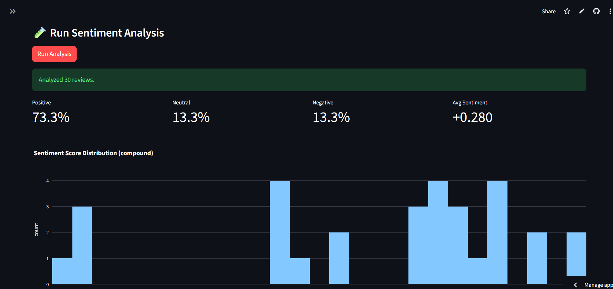

# Project 3 — AI Review Sentiment Dashboard
**Category:** Data + AI  
**Skills:** NLP analysis, Data visualization  
**Deployment:** Streamlit Cloud
[]([https://huggingface.co/spaces/SathishLella/genai-pdf-qa-chatbot-groq](https://ai-review-sentimental-dashboard.streamlit.app/))

An end‑to‑end Streamlit app that ingests a CSV of reviews, runs sentiment analysis (VADER by default; optional Transformers), and visualizes insights with Plotly.

## Features
- Upload CSV (`review_text` required; optional `date`, `rating`, `product`)
- Choose model automatically:
  - **Default (lightweight):** NLTK VADER (no GPU/key)
  - **Optional:** Transformers (SST‑2) if secret `USE_TRANSFORMERS=1`
- KPI tiles (Positive/Neutral/Negative %, Average compound score)
- Charts: distribution, pie by labels, weekly trend, box by rating, top keywords
- Review explorer with filters + CSV export

## Run locally
```bash
pip install -r requirements.txt
streamlit run app.py
```

## Deploy on Streamlit Cloud (no localhost)
1. Create a new app on **Streamlit Cloud** and connect to a repo (or upload these files).
2. Set **Python version** to 3.10+ (default is fine).
3. (Optional) In **Secrets**, set:
   ```toml
   USE_TRANSFORMERS = "1"
   ```
4. Deploy. The app will start; first load may download models.

## CSV format
- **Required:** `review_text`
- **Optional:** `date` (YYYY-MM-DD), `rating` (1–5), `product`
A `sample_reviews.csv` is included for demo.

## Notes
- VADER is fast and works well for product/service reviews.
- Transformers give stronger nuance but require more resources.
- For OCR/scanned inputs, preprocess text before uploading.

## Roadmap ideas
- Aspect-based sentiment (e.g., "battery", "delivery", "support")
- Topic modeling (LDA/BERTopic)
- Multi-language support (translate then score)
- Authentication for private dashboards
